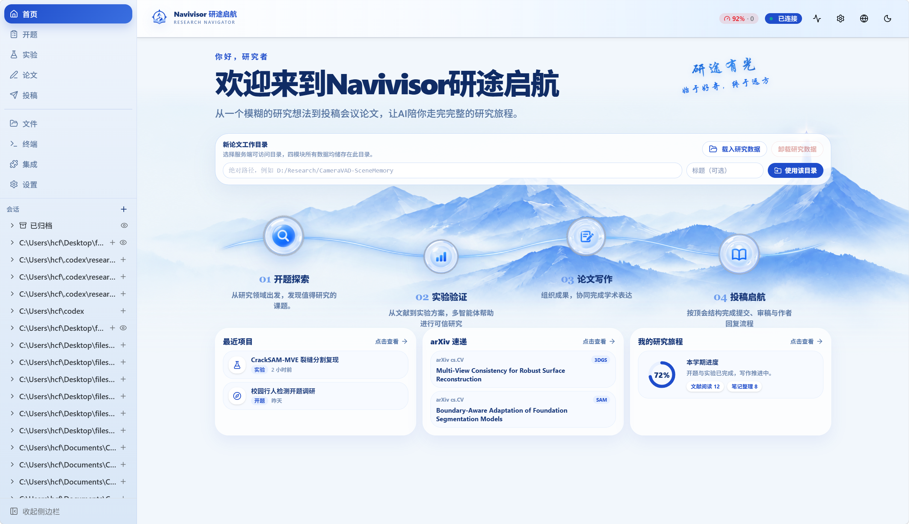

# 启航科研智能体 · Navivisor

面向科研新手的工作台：从开题、实验、论文写作到会议投稿，四个模块共用同一篇论文的工作目录。同时保留 Codex 对话、文件、终端和工具管理能力。



## 技术栈

- **前端：** React 19、TypeScript、Vite、Tailwind CSS、TanStack Router / Query、Zustand、Radix UI。
- **后端：** NestJS 11、Fastify、Socket.IO、SSH2 与 Node PTY，提供 REST API、实时通信、远程实验和终端能力。
- **数据层：** SQLite、Drizzle ORM 与本地工作目录，统一管理项目、研究产物和运行记录。
- **工程化：** pnpm、Vitest、ESLint、OpenAPI 类型生成，并集成 Codex CLI 与 LaTeX 论文编译流程。

## 安装与启动

需要 Node.js 22.12+、pnpm 10（仓库锁定 10.18.3）。后端为 NestJS，前端为 React/Vite，数据使用 SQLite 和本地文件目录。

```bash
git clone https://github.com/houchenfeng/Navivisor-webui.git
cd Navivisor-webui
pnpm install
pnpm --dir web install
pnpm ensure:env
```

首次初始化会创建根目录 `.env`。请保留自己的配置，不要把 `.env` 提交进仓库。

打开两个终端，在仓库根目录分别运行：

```bash
pnpm start:dev
```

```bash
pnpm --dir web dev
```

打开前端终端显示的地址，默认 [localhost:5173](http://localhost:5173)；后端默认 8172。前端已代理 API 与 WebSocket。后端改端口时，同步修改 `web/vite.config.ts` 的代理目标。

### 本地必要安装：Codex CLI 与 LaTeX

科研写作、翻译、配图要能调起 **Codex CLI**；写作页一键编译 CVPR PDF 要能调起本机 **LaTeX**。这两项都装在你跑后端的那台机器上，并保证终端里能直接执行对应命令。

**1. Codex CLI**

`pnpm install` 会装上仓库锁定的 `@openai/codex`。请先确认命令可用：

```bash
codex --version
```

- Windows：若 `codex` 不在 PATH 里，在 `.env` 指向捆绑二进制，例如：
`CODEX_BIN=./node_modules/@openai/codex-win32-x64/vendor/x86_64-pc-windows-msvc/bin/codex.exe`
- macOS / Linux：把 `codex` 加入 PATH，或同样用 `CODEX_BIN` 写绝对路径。
- 可选：`CODEX_HOME` 指定 Codex 数据目录（默认 `~/.codex`）。

启动后端后，在页面「设置 → 账户」完成 ChatGPT 设备登录。也可以按账户配置填写 `OPENAI_API_KEY`，走 API Key 模式。找不到可执行文件时，后端无法做写作生成。

**2. LaTeX（pdflatex + bibtex）**

用于把 `main.tex` 编成 PDF。请安装发行版并把 `pdflatex`、`bibtex` 加入 PATH：

- Windows：[MiKTeX](https://miktex.org/download) 或 [TeX Live](https://www.tug.org/texlive/)
- macOS：[MacTeX](https://www.tug.org/mactex/)
- Linux：发行版中的 TeX Live（如 `texlive-full` 或等价包）

检查：

```bash
pdflatex --version
bibtex --version
```

命令不叫 `pdflatex` 时，在 `.env` 设置 `LATEX_COMMAND` 为实际可执行文件。未安装时，写作页可以下载 TeX 源文件，但不会在服务器上编出 PDF。


| 可选配置                         | 用途                             |
| ---------------------------- | ------------------------------ |
| PORT                         | 后端端口，默认 8172                   |
| CODEX_BIN / CODEX_HOME       | Codex 可执行文件与运行数据目录             |
| WEBUI_DB_PATH                | SQLite 数据库路径                   |
| NAVIVISOR_RESEARCH_WORK_ROOT | 未绑定用户目录时的科研托管根目录               |
| OPENALEX_API_KEY             | 开题文献检索（仅后端调用 OpenAlex，不要写入前端）  |
| LATEX_COMMAND                | 本机 LaTeX 可执行文件；默认寻找 `pdflatex` |


完整配置见 [.env.example](./.env.example)，容器部署见 [Docker 说明](./docs/docker.md)。

共同输入输出格式见 `research-tools/contract.md`。演示用数据包在 `demo-packages/evivad-surveillance-demo/`（监控视频异常检测 EviVAD 全链路样例，随仓库提交）。

## 科研模块使用说明

四个模块按顺序构成一条完整链路：**开题探索 → 实验验证 → 论文写作 → 投稿启航**。它们读写同一份工作目录，不要为同一篇论文建两套路径。

### 开始之前：注册论文工作目录

想一次看完四个模块时，先在科研首页点 **「载入研究数据」**。系统会把 `demo-packages/evivad-surveillance-demo/` 整包拷进工作目录（开题、实验、写作、投稿），之后按模块走一遍即可演示全部流程。

也可以从空白目录自己做：

1. 打开 [科研首页](http://localhost:5173/research/home)（`/research/home`）。
2. 在「新论文工作目录」中选择**服务端可访问**的文件夹并注册。
3. 目录需要落在 Files 服务允许的工作区范围内。注册成功后，四个模块都会把课题、方案、稿件和审稿材料写进这个目录。
4. 侧栏可在「开题 / 实验 / 写作 / 投稿」之间切换；刷新后仍会记住当前论文。

一篇论文所有数据都在工作目录中，结构大致如下：

```text
paper-workspace/
  topic/         研究方向、文献表、核心 PDF、BibTeX
  experiment/    方案、配置、指标、结果说明、效果图
  writing/       章节草稿、LaTeX、参考文献、论文 PDF
  submission/    投稿信息、审稿意见、作者回复
```

---

### 一、开题探索（`/research/topic`）

**做什么：** 把模糊的兴趣落实成为一个可做的课题，并检索核心参考文献，供实验和写作使用。

**怎么用：**

1. 阅读开题说明后，在第一步填写 **研究方向**（必填），例如「视频异常检测」「语义分割」。可选填写研究目标或场景约束，例如「和视觉语言模型结合」「监控摄像头场景」。
2. 发起检索。系统用 OpenAlex 数据库按自适应策略查文献（先收窄、不够再放宽），并给出该领域的相关论文。真实检索需在后端配置 `OPENALEX_API_KEY`。
3. 查看研究态势后，进入**候选课题**页：通常会得到三个细化的交叉研究课题。点选最合适的一条并确认。
4. 进入 **核心参考文献**：系统会继续找细化后课题相关的文献，尽量拉取可获取的全文 PDF，并整理交接材料（文献表、BibTeX、开题说明）。
5. 核对名单与全文是否对齐后，从页面底部进入实验模块。

开题产出会写入 `topic/`，实验模块会读取其中的确认课题、核心文献和交接说明。

---

### 二、实验验证（`/research/experiment`）

**做什么：** 从核心文献出发，形成可执行的创新点方案，在本机或远程服务器上完成实验（或整理已有结果），把表格、架构图和结果说明交给写作模块。

**步骤：**

1. **课题与文献**
  核对开题交接过来的核心文献和 PDF。
2. **方案确认**
  根据核心文献全文整理6个创新点。每一条写清：Baseline、数据、指标、参考代码与改动方案、训练与测试参数设置、创新点保留通过/不通过的标准。会议论文通常最终保留三个能独立验证的创新点。点开创新点卡片可看完整方案，确认后再继续。
3. **模式选择**
  - **模拟运行**：按已确认方案整理配置与结果材料。  
  - **真实运行**：填写本机或 SSH 配置；SSH 会在实验终端同步命令与输出。
4. **实验配置**
  补全代码目录、数据目录、结果目录；真实运行还要填主机、用户、端口，设置实验代码和数据的具体路径等。
5. **实验执行**
  启动运行或确认配置。真实运行可在嵌入终端里看会话。
6. **成果交付**
  查看主结果表、消融、架构说明、效果图，下载 Markdown。完成后从底部进入写作模块。

实验产出在 `experiment/`（`plan.md`、`results.md`、指标 CSV、架构与对比图等）。写作页可以一键填入这些材料。

---

### 三、论文写作（`/research/paper`）

**做什么：** 按 CVPR 模板把实验成果写成会议文章，并导出 LaTeX / PDF。

**十步流程：**


| 步   | 名称        | 说明                                             |
| --- | --------- | ---------------------------------------------- |
| 1   | 上传素材      | 填写课题名称；放入实验细节、实验结果、BibTeX。可一键填入实验模块已有材料。       |
| 2   | 标题与摘要     | 写英文标题与摘要                                       |
| 3–4 | 引言 / 相关工作 | 结合核心文献撰写                                       |
| 5   | 算法介绍      | 写方法章节；可生成或替换架构流程图、示意图。                         |
| 6   | 实验结果      | 写实验章节，展示结果表与效果图。                               |
| 7   | 讨论和展望     | 写局限与后续工作。                                      |
| 8   | 引用文献      | 整理 `.bib` 条目。                                  |
| 9   | 全文预览      | 检查文稿是否齐套。                                      |
| 10  | 生成 LaTeX  | 导出 `main.tex`，或一键编译 CVPR 格式 PDF；也可下载 zip 离线编译。 |


最后一步可从页面底部进入投稿模块。导出包会带上官方模板文件（`cvpr.sty`、`preamble.tex`、`ieeenat_fullname.bst`）。本机需已按上文安装 LaTeX。找不到 `pdflatex` 时页面会提示，而不会编出 PDF。离线编译示例：

```bash
pdflatex -interaction=nonstopmode -halt-on-error main.tex
bibtex main
pdflatex -interaction=nonstopmode -halt-on-error main.tex
pdflatex -interaction=nonstopmode -halt-on-error main.tex
```

---

### 四、投稿启航（`/research/submit`）

**做什么：** 按顶会（界面为 CVPR / OpenReview 风格）走完提交、初审、作者回复和最终决定。

**六步流程：**

1. **OpenReview 首页**
  了解会议入口与截稿信息。
2. **会议页**
  进入 CVPR 投稿入口。
3. **投稿表单**
  上传论文 PDF；标题、作者、关键词、摘要、TL;DR 可用 AI 辅助填写。若已载入当前论文的工作数据，上传 PDF 与 AI 辅助会读取该论文目录中的稿件与元数据。填完后提交。
4. **初审**
  阅读三位审稿人的意见（创新性、实验、写作与格式等）和评分。
5. **Rebuttal**
  逐条回复 weakness 与 question；可用 AI 辅助生成回复草稿，再自行修改后提交。
6. **最终结果**
  查看决定与二轮分数。若接收，可上传 camera-ready PDF，并用 AI 辅助写致谢。

审稿与回复材料保存在 `submission/`。这是流程演练，不会把稿件提交到真实的 OpenReview 或 CVPR。

---

## Codex 对话与工具

左侧栏下半部分 可新建或打开 Codex 对话，选择模型与工作目录后发送任务。主要包括：多会话与流式回复、分叉与归档、文件浏览与差异、终端与审批、Skills / MCP / 插件、用量与诊断。协议见 [REST API](./docs/rest-api.md)、[终端](./docs/terminal.md)、[审批](./docs/approval.md)。

## 质量检查

```bash
pnpm build
pnpm test
pnpm --dir web build
pnpm --dir web test
pnpm --dir web lint
```

## Skill 清单

路径均相对于仓库根目录。Codex 科研工作流按模块注册四个主 Skill（`research-skills/`）。开题另外还有文献来源适配规范（`research-tools/` 下的 `SKILL.md`），以及首次检索 / 核心文献打包脚本。它们不是四个并列的「页面 Skill」，但开题实际会用到不止 `research-topic` 一个。

### 工作流主 Skill（Codex 按阶段调用）


| 阶段  | 名称                    | 路径                                             | 做什么                                                        |
| --- | --------------------- | ---------------------------------------------- | ---------------------------------------------------------- |
| 开题  | `research-topic`      | `research-skills/research-topic/SKILL.md`      | 把研究方向与已有文献证据收成可追溯课题：检索策略、候选课题、确认课题、核心文献交接。不编造论文、DOI 或检索结果。 |
| 实验  | `research-experiment` | `research-skills/research-experiment/SKILL.md` | 基于已确认课题做方案、运行解读与写作交接。区分真实 runner 输出与事后解读，不编造日志、指标或硬件。      |
| 写作  | `research-writing`    | `research-skills/research-writing/SKILL.md`    | 按已定稿的实验与文献写大纲、正文、翻译、元数据和配图；经验与引用必须能对上输入文件。                 |
| 投稿  | `research-submission` | `research-skills/research-submission/SKILL.md` | 对照会议要求做投稿检查、打包与材料准备。不声称已经交到真实投稿系统，除非有独立适配器给出凭证。            |


| 名称            | 路径                                 | 做什么                                                  |
| ------------- | ---------------------------------- | ---------------------------------------------------- |
| OpenAlex 来源适配 | `research-tools/openalex/SKILL.md` | 开题默认文献源：公开 API 查元数据与摘要、分页去重、写出可复现查询计划。不负责保证每篇都有 PDF。 |
| Scopus 来源适配   | `research-tools/scopus/SKILL.md`   | 同样契约下的机构数据库来源。当前待授权，无合法 API 权限时不可运行。                 |
| 首次检索          | `research-tools/first-search/`     | 研究方向 → 大批量元数据/摘要 → 最多三个待核验候选课题。不下载 PDF、不生成 BibTeX。   |
| 核心文献包         | `research-tools/core-literature/`  | 课题确认之后：筛核心文献、写 CSV/BibTeX、尝试合法 OA PDF，交给实验模块。        |


实验远程执行还会用到 `research-tools/ssh-experiment/run_navivisor_experiment.py`（SSH 侧运行脚本），它不是 Codex Skill。算法流程图是 `research-writing` 内的动作，见 `research-skills/research-writing/references/algorithm-flowchart-generation.md`。

## 版本更新

改动全过程记录见 [`docs/TODO-topic-realization.md`](./docs/TODO-topic-realization.md)（修改清单 / demo 资产清单 / 测试清单 / 最终结果）。

| 版本 | 日期 | 变更摘要 | 影响文件 |
| --- | --- | --- | --- |
| v0.14.0 | 2026-10-08 | **页面组装（T49）**：新增 ，把 17 张卡片按执行顺序接进页面，分「第一段 · 宽检索→态势→研究空白→选题」与「第二段 · 核心文献→分批分析→课题孵化」两节。第一段读 ，第二段按 payload 是否到达推导状态（空列表仍算未跑）。修两处真 bug：**批次编号 0-based 显示成「第 00 批」**、**有数据的卡片仍默认折叠**（统一为「有数据展开、无数据折叠」，失败/运行中的批次例外）。新增 17 个单测。 | 、 |
| v0.13.0 | 2026-10-08 | **第二批 10 张过程卡片（T48）**：`core-query-card`（各组合命中/采纳数，**0 命中的组合明确提示概念群过窄**）、`seed-papers-card`（Top20，**无 OpenAlex ID 的种子标注「无法做反向引用」**）、`reverse-citation-card`（**区分「检索失败」与「确实没有近期引用」**）、`relevance-score-card`（**「未判定成功」独立计数，不计入淘汰**）、`fallback-log-card`（**指名首个零产出的阶梯**，全阶梯有产出时说明是课题本身文献少）、`baseline-card`（**机械选取的条目单独标注**）、`pdf-download-card`（失败原因逐条列出，不只给数字）、`batch-prep-card`（编号区间而非全量编号）、`batch-analysis-card`（**区分 skipped 与 pending**）、`synthesis-card`（元分析/降维双模式共用；**不可折叠，避免「生成」按钮被折叠隐藏**）。新增 22 个组件单测。 | `web/src/components/research-topic/cards/*.tsx` |
| v0.12.0 | 2026-10-08 | **第一批 7 张过程卡片（T47）**：`query-plan-card`（实际发送的 OQL 与 arXiv 检索式双展示、可复制、版本 A/B 切换、概念拆解、排除项）、`search-result-card`（双源命中/去重/年份窗口 + 不足 100 篇提示）、`relevance-card`（相关度、不相关样例与原因、优化后检索式、**迭代按钮到 3 轮上限自动禁用并说明**）、`venue-tier-card`（三梯队 + **一梯队占比作为头条数字**）、`landscape-card`（6 个可折叠子节）、`research-gap-card`（**零共现组合用独立高警示块**，不让「无直接题名共现证据」成为最小号字）、`candidate-topic-card`（沿用「选择此题」+ **立论依据含「待核验」时高亮**）。新增 20 个组件单测。 | `web/src/components/research-topic/cards/*.tsx` |
| v0.11.0 | 2026-10-08 | **前端类型与卡片基座（T45/T46/T52）**：`topic-workflow-contract.ts` 增加 `StageSnapshot` / `CoreAnalysisProgress`，`ResearchTaskSnapshot` 增加 `stages` / `warnings`；新增 `cards/stage-card.tsx` 通用卡片壳 —— 统一状态徽标（5 态）、**「兜底模型作答」标记**（避免某个卡片自己漏掉 qwen 兜底的事实）、warning 中文说明、折叠展开、查看 md / 下载动作。新增 19 个组件单测。 | `web/src/components/research-topic/{topic-workflow-contract.ts,cards/stage-card.tsx}` |
| v0.10.0 | 2026-10-08 | **核心文献采集与 Python 交接（T32/T36）**：新增 `core-collect.ts` —— `fetchArxivLatest()` 拉取语义群近 6 个月 arXiv 新投稿（arXiv API 无日期过滤，本地按 `published` 过滤；**失败会返回 `failed: true` 而不是伪装成「没有新投稿」**）；`buildCorePackInput()` 让 `selection.targetCount` 等于**实际选中的篇数**（此前固定 100 会让流水线看起来总是差目标），且 `maxCandidatesToAttempt` 不会超过实际篇数；`papers.json` 增加 `refId` 使打包器与分批分析对同一篇文献的引用一致。新增 10 个单测。 | `src/research-topic/{core-collect,research-topic.service}.ts` |
| v0.9.0 | 2026-10-08 | **分批 AI 分析（Part G）**：新增 `batch-analyzer.ts` —— 指令一逐批（50 篇/批）深度分析，产出矩阵与报告两份 md；**断点续跑**（报告已存在且非空即跳过，`progress.json` 每批写盘，中断后可低成本续跑）；**串行执行**避开 Codex 限流；模型答成散文时保留原文而非丢弃成果。指令二（元分析）与降维指令共用同一份 `synthesis-input.txt`，可分别生成两种课题视图。新增 `parseCsvRows`（正确处理引号、转义引号与字段内换行——`renderCsv` 三种都会产出，朴素 `split(',')` 会损坏含逗号的标题）。新增 4 条路由：`POST /core-literature/analyze`、`GET /core-literature/analysis`、`POST /core-literature/synthesize`、`GET /core-literature/artifacts/:name`。新增 15 个单测。 | `src/research-topic/{batch-analyzer,batch-prep,research-topic.service,research-topic.controller}.ts` |
| v0.8.0 | 2026-10-08 | **第二批核心文献模块**：新增 6 个模块 —— `core-query.ts`（虚词剔除 + 概念群 + 由精确到宽泛的 5 种组合；组合里任一命名概念群为空即跳过，避免阶梯里同一检索被两个标签重复计数）、`seed-papers.ts`（被引 Top20，并列时老年份优先、再按 id 保证可复现）、`reverse-citations.ts`（反向引用近 6 个月，**按种子独立容错**：某个种子失败会记进 failures 而不是伪装成「该种子无近期引用」）、`relevance-scoring.ts`（10 篇/批逐篇打分，**丢弃不在本批的 id** 防止幻觉 id 注入，批失败重试 1 次后计入 `unscored` 而非当作不相关）、`fallback-ladder.ts`（4 级阶梯，未达标时明确指出**是哪一步收窄**，不补造）、`baseline-finder.ts`（AI 选 baseline；不足 3 篇时用被引量机械补齐并标 `fallback: true`；**丢弃标题不在输入中的条目**防止幻觉论文被当作可运行 baseline）、`batch-prep.ts`（RE 编号 + 50 篇/批 + `references.csv`（`paper_id` 与 `refId` 同值）+ `.bib` + `handoff.md`；CSV 字段正确转义，未下载 PDF 的 `pdf_path` 留空不猜测）。新增 57 个单测。 | `src/research-topic/{core-query,seed-papers,reverse-citations,relevance-scoring,fallback-ladder,baseline-finder,batch-prep}.ts` |
| v0.7.0 | 2026-10-08 | **候选课题改造（T27）**：新增 `candidate-topics.ts`；三个候选改为按**风险取向**区分（偏可行 = 现成数据集/baseline 可启动、偏创新 = 针对识别出的空白或争议、较平衡居中），且必须引用 `RE-nnn` 编号或可定位的论文标题，证据不足须写「待核验」。`executeCandidateGeneration()` 不再直连 `codex exec`，改用 `AiProviderFactory`（获得 qwen 兜底与 `fallbackUsed` 留痕）；上游空白/态势/期刊分层结果作为可选上下文注入（缺失不报错，只是依据变弱）；原始模型输出保留在 `candidates/codex-output.json` 供审计，同时渲染 `first-search/candidate-topics.md`。新增 9 个单测。 | `src/research-topic/{candidate-topics,research-topic.service}.ts` |
| v0.6.0 | 2026-10-08 | **第一批分析阶段 + 路由**：新增 `relevance-feedback.ts`（相关度自检，最多 3 轮，只有概念组真的变了才回写新检索式）、`venue-tiering.ts`（期刊分层，篇数永远取自本地统计而非模型自报）、`landscape-analysis.ts`（态势分析，只发「编号/标题/期刊/年份」四字段控制上下文）、`research-gaps.ts`（空白识别，强制给零共现组合加「无直接题名共现证据」标注）。各阶段按需触发并落盘（`query-plan.json`、`relevance-check-round-N.json`、`venue-tiers.{json,md}`、`landscape.json` + 4 份分块 md、`research-gaps.{json,md}`）。新增 6 条路由：`GET /stages`、`POST /relevance-check|venue-tiering|landscape|research-gaps`、`GET /artifacts/:name`（带文件名白名单）。新增 18 个单测。 | `src/research-topic/{relevance-feedback,venue-tiering,landscape-analysis,research-gaps,research-topic.service,research-topic.controller}.ts` |
| v0.5.0 | 2026-10-08 | **第一批流水线骨架**：`ResearchTopicTask` 新增 `stages`（7 个阶段的状态机：query-plan / search / relevance-check / venue-tiering / landscape / research-gaps / candidates）与 `warnings`；`execute()` 接入 query-plan 阶段（AI 规划检索式并落盘 `query-plan.json`）与双源检索（OpenAlex + arXiv 并行、DOI/标题双键去重、年份硬过滤）；AI 不可用时降级为关键词兜底并记 `query_plan_fallback` 警告；结果不足 100 篇记 `insufficient_results`，**不补造数据**。数量门槛 300–800 放宽到 **100–800**（契约文档同步）。 | `src/research-topic/{research-topic.types,research-topic.service}.ts`、`research-tools/{README,contract}.md` |
| v0.4.0 | 2026-10-08 | **检索式生成**：新增 `src/research-topic/prompts/`，把飞书文档《科研论开题》的 7 份提示词**原文落盘**（Scopus 检索式设计 / 检索式调整 / 期刊分层 / 领域分析助手 / 指令一 / 指令二 / 降维指令）；新增 `query-planner.ts`（AI → 结构化 `QueryPlan`）与 `query-renderers.ts`（OpenAlex OQL / arXiv / Scopus 三源渲染，纯函数可单测）；新增 `arxiv-client.ts`（Atom 解析 + ≥3s 限速 + 429/5xx 重试）；删除 `openalex-query.ts` 中 `video anomaly` / `semantic segmentation` 两套硬编码领域词（前后端各一份），改为 AI 规划 + 无领域假设的兜底。新增 25 个单测。 | `src/research-topic/prompts/*.ts`、`src/research-topic/{query-planner,query-renderers,arxiv-client,openalex-query}.ts`、`web/src/components/research-topic/openalex-query.ts` |
| v0.3.0 | 2026-10-08 | **AI provider 抽象**：新增 `src/research-topic/ai/`，把 Codex CLI 与 OpenAI 兼容 HTTP（DashScope `qwen3.8-max-0902`）统一为 `AiProvider` 接口。`AiProviderFactory` 默认以 codex 为主、http 为兜底（`NAVIVISOR_AI_PROVIDER` / `NAVIVISOR_AI_FALLBACK`），兜底必定留痕（`fallbackUsed`），两者都失败时抛主 provider 的错误。附带容错 JSON 提取 `extractJsonPayload`。新增 13 个单测。 | `src/research-topic/ai/{ai-provider,codex-provider,http-provider,ai-provider.factory}.ts`、`src/research-topic/research-topic.module.ts` |
| v0.2.0 | 2026-10-08 | **去 demo（开题链路）**：删除整套演示数据与入口。后端移除 `demo-packages/`、demo 加载/校验服务方法与 `DemoManifest*` 类型、`/research/demos` 与 `/research/projects/:id/demo/load` 端点；前端移除 `LoadWorkspaceDemoButton`、`exitResearchDemo`、`demoTaskSnapshot` 假数据、实验模块离线假指标回退、写作模块 `DEMO_*` 兜底素材。检索失败改为真实空态 + 明确错误 + 可重试，**不再回退演示数据**。保留全部真实功能（科普弹窗、文件管理、多会话/token、终端 + SSH、插件/skill/MCP、深夜模式、Codex 配置、OnlyOffice、LaTeX 编译、Artifact 证据链与 run 状态机）。 | `src/research-workflow/{research-contracts,research-workspace.service,research-workspace.controller}.ts`、`demo-packages/`、`scripts/*demo*`、`web/src/components/research-{topic,workflow,experiment,writing,home,submission}/**`、`.gitattributes` |
| v0.1.0 | 2026-10-08 | 环境准备：`vitest.config.mts` 提高 `testTimeout`/`hookTimeout` 至 60s（仓库位于慢速副盘，`afterEach` 递归清理超过 10s 默认上限）；`.gitignore` 排除本地密钥备份；新增改动总账 `docs/TODO-topic-realization.md`。 | `vitest.config.mts`、`.gitignore`、`docs/TODO-topic-realization.md` |

### 分支说明

- `main`：真实版本（去 demo，逐步落地真实能力）
- `demo-2026-10-07`：改造前的完整存档（含全部 demo 模式），基线提交 `6530bc5`

## 上游与许可

基于 [LimLLL/codex-webui](https://github.com/LimLLL/codex-webui) 二次开发，使用 AGPL-3.0-or-later，见 [LICENSE](./LICENSE)。更多资料见 [文档索引](./docs/README.md)。
